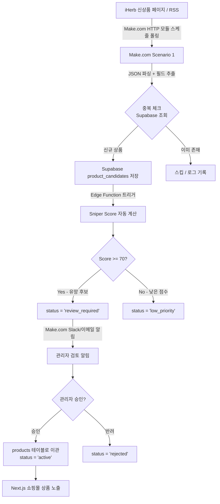
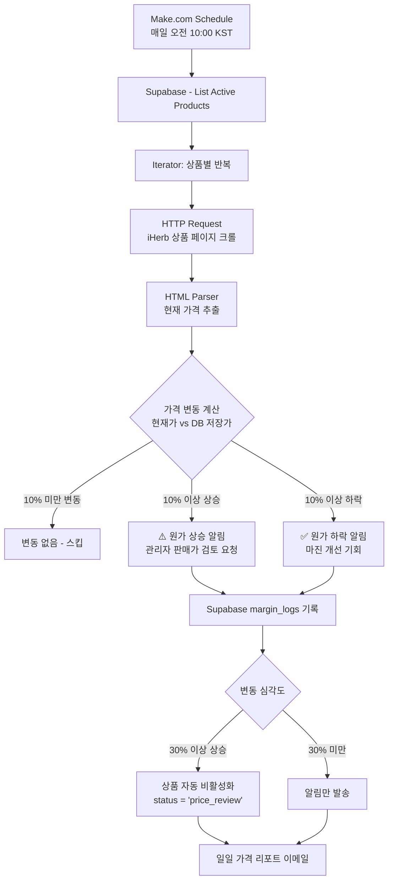
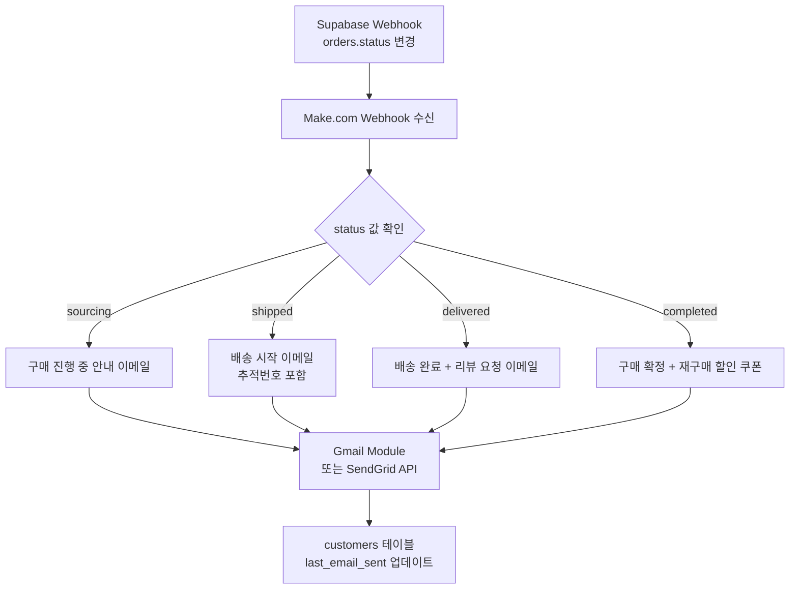
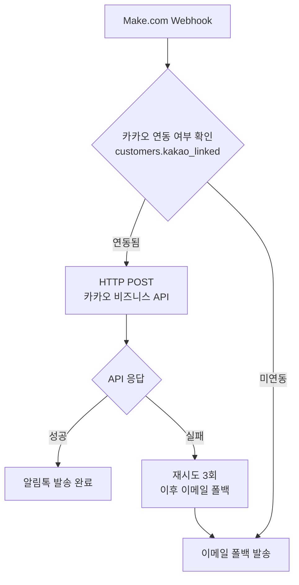
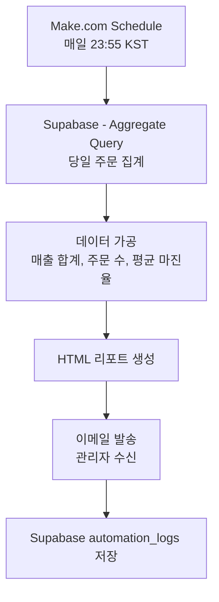

# Sniper Buying Dashboard — 자동화 흐름 설계서

> 기술스택: Next.js + TypeScript + Supabase + Vercel + Make.com  
> 무료/저비용 우선 원칙 | Make.com 무료 플랜 기준 (1,000 ops/월)  
> 최종 수정: 2026-05-26

---

## 1. 전체 자동화 아키텍처 개요

본 시스템은 1인 해외 구매대행 쇼핑몰 운영을 위한 자동화 파이프라인으로,  
Make.com을 자동화 허브로 활용하여 상품 발굴 → 주문 처리 → 배송 추적 → 고객 알림의  
전 과정을 최소 수작업으로 운영하도록 설계한다.

### 1.1 자동화 레이어 구조

```
[외부 소스]          [자동화 허브]       [데이터 저장소]     [프론트엔드]
iHerb / 쿠팡       Make.com           Supabase           Next.js
배송 API      ──→  Scenarios    ──→   PostgreSQL   ──→   Dashboard
이메일/Slack        (5개 시나리오)      Edge Functions     Vercel 배포
```

---

## 2. 상품 발굴 자동화 흐름

### 2.1 전체 흐름 다이어그램



### 2.2 Make.com 모듈 체인 (시나리오 1)

| 순서 | 모듈명 | 설명 | ops 소비 |
|------|--------|------|---------|
| 1 | Schedule | 매일 09:00 KST 트리거 | 1 |
| 2 | HTTP - Make a Request | iHerb 신상품 URL 요청 | 1 |
| 3 | JSON - Parse JSON | 응답 데이터 파싱 | 0 |
| 4 | Tools - Set Variable | 필드 정규화 (가격, 이름) | 0 |
| 5 | Supabase - Search Records | 중복 상품 확인 | 1 |
| 6 | Router | 신규/기존 분기 | 0 |
| 7 | Supabase - Create a Record | candidates 테이블 저장 | 1 |
| 8 | Email / Slack | 관리자 알림 (고점수만) | 1 |

> 1회 실행 총 ops 약 5개 | 신상품 10개 처리 시 약 50 ops

### 2.3 Sniper Score 자동 계산 로직

Supabase Edge Function (`calculate-sniper-score`)이 candidates INSERT 이벤트를 수신하여  
아래 항목을 자동으로 채운다.

| 항목 | 배점 | 계산 방법 |
|------|------|---------|
| 국내수요 | 20점 | 네이버 쇼핑 검색량 추정 (초기: 수동 입력) |
| 해외가격경쟁력 | 20점 | (국내 경쟁가 - 총원가) / 국내 경쟁가 × 100 |
| 마진율 | 20점 | marginRate 기준 구간 점수화 |
| 배송안정성 | 15점 | 카테고리별 배송 이력 통계 |
| 통관리스크(역) | 10점 | riskLevel 기반 역점수 |
| 경쟁강도(역) | 5점 | 쿠팡/네이버 등록 수 역산 |
| 상세페이지설득력 | 5점 | 이미지 수, 상세설명 길이 기준 |
| 자동화적합도 | 5점 | 표준화 가능 품목 여부 |

---

## 3. 주문 처리 자동화 흐름

### 3.1 전체 흐름 다이어그램

```mermaid
flowchart TD
    A[고객 주문 (Next.js 프론트)] -->|Supabase orders INSERT| B[Supabase Webhook 발화]
    B -->|Make.com Webhook 수신| C[Make.com Scenario 2]
    C --> D[주문 데이터 파싱\n상품명, 수량, 옵션, 주소]
    D --> E[관리자 이메일 알림\n소싱지 구매 지시서 첨부]
    E --> F[관리자 iHerb 수동 구매]
    F -->|관리자 대시보드에서 상태 변경| G[orders.status = 'sourcing']
    G -->|Supabase UPDATE Webhook| H[Make.com Scenario 4]
    H --> I[배송 추적 API 연동]
    I -->|추적번호 획득| J[orders.tracking_number 저장]
    J -->|Supabase UPDATE Webhook| K[고객 배송 알림 발송]
    K --> L{알림 채널}
    L -->|이메일| M[Gmail/SendGrid 발송]
    L -->|카카오| N[카카오 알림톡 API]
    M & N --> O[고객 수령 완료]
    O -->|7일 후 자동| P[orders.status = 'completed']
```

### 3.2 주문 상태 전이 정의

```
pending → sourcing → purchased → shipped → delivered → completed
   ↓                                            ↓
cancelled                                   return_requested
```

| 상태 | 설명 | 자동화 트리거 여부 |
|------|------|-----------------|
| pending | 주문 접수 완료 | Make.com 알림 자동 발송 |
| sourcing | 관리자 소싱 시작 | 수동 변경 |
| purchased | iHerb 구매 완료 | 수동 변경 |
| shipped | 국제 배송 중 | 배송 API 자동 업데이트 |
| delivered | 국내 도착 | 배송 API 자동 업데이트 |
| completed | 최종 완료 | 7일 후 자동 전환 |

### 3.3 관리자 알림 이메일 템플릿

```
제목: [주문 접수] #{order_id} - {product_name} x{quantity}

━━━━━━━━━━━━━━━━━━━━━━
 주문 ID: {order_id}
 주문 시각: {created_at}
 상품명: {product_name}
 수량: {quantity}개
 옵션: {options}
━━━━━━━━━━━━━━━━━━━━━━
 고객 정보
 이름: {customer_name}
 이메일: {customer_email}
 배송지: {shipping_address}
 개인통관고유번호: {customs_id}
━━━━━━━━━━━━━━━━━━━━━━
 소싱 링크: {source_url}
 예상 원가: ₩{total_cost}
 예상 마진: ₩{expected_margin}
━━━━━━━━━━━━━━━━━━━━━━
```

---

## 4. 가격 모니터링 자동화 흐름

### 4.1 전체 흐름 다이어그램



### 4.2 가격 변동 알림 기준

| 변동 폭 | 액션 | 알림 채널 |
|--------|------|---------|
| ±5% 미만 | 로그만 기록 | 없음 |
| ±10% 이상 | 관리자 알림 | 이메일 |
| ±20% 이상 | 긴급 알림 + 검토 요청 | 이메일 + Slack |
| +30% 이상 | 상품 자동 비활성화 | 이메일 + Slack |

### 4.3 Make.com 모듈 체인 (시나리오 3)

| 순서 | 모듈명 | ops |
|------|--------|-----|
| 1 | Schedule (매일 10:00) | 1 |
| 2 | Supabase - Search Records (active 상품 목록) | 1 |
| 3 | Iterator | 0 |
| 4 | HTTP Request (상품별 가격 조회) | N×1 |
| 5 | Tools - Set Variable (변동률 계산) | 0 |
| 6 | Router (변동 임계치 분기) | 0 |
| 7 | Supabase - Update Record | N×1 |
| 8 | Email (알림 필요 시) | 조건부 |

> 상품 20개 기준: 약 45 ops/일 → 월 약 1,350 ops (무료 플랜 초과 주의)  
> 권장: 상품 10개 이하로 시작 → 월 약 680 ops 유지

---

## 5. 고객 알림 자동화 흐름

### 5.1 이메일 알림 흐름



### 5.2 카카오 알림톡 연동 흐름



### 5.3 알림 이벤트별 메시지 정의

| 이벤트 | 채널 | 메시지 요약 |
|--------|------|-----------|
| 주문 접수 | 이메일 | "주문이 확인되었습니다. 소싱을 시작합니다." |
| 구매 완료 | 이메일 | "해외에서 구매가 완료되었습니다. 배송까지 약 5-10일 소요됩니다." |
| 배송 시작 | 이메일+카카오 | "배송이 시작되었습니다. 운송장번호: {tracking}" |
| 국내 도착 | 이메일+카카오 | "국내에 도착했습니다. 1-3일 내 수령 예정입니다." |
| 배송 완료 | 이메일 | "배송 완료! 리뷰를 남겨주시면 500포인트를 드립니다." |

---

## 6. 일일 매출 리포트 자동화



---

## 7. 전체 ops 사용량 월간 추정

| 시나리오 | 실행 빈도 | 1회 ops | 월 ops |
|--------|---------|---------|--------|
| 신상품 수집 | 1회/일 | 5 | 155 |
| 주문 알림 | 주문당 1회 (예: 20건/월) | 4 | 80 |
| 가격 모니터링 | 1회/일 × 10상품 | 23 | 713 |
| 배송 업데이트 | 3회/주문 × 20건 | 2 | 120 |
| 일일 리포트 | 1회/일 | 3 | 93 |
| **합계** | | | **1,161** |

> 무료 플랜 1,000 ops/월 약간 초과 예상  
> 절감 방안: 가격 모니터링을 격일 실행으로 변경 → 약 -357 ops → **804 ops/월** (무료 플랜 내)

---

## 8. 에러 처리 전략

### 8.1 Make.com 공통 에러 처리

```
각 시나리오에 Error Handler 모듈 적용:
- HTTP 모듈: 타임아웃 30초, 재시도 3회 (지수 백오프)
- Supabase 모듈: Connection 에러 시 1분 후 재시도
- Email 모듈: 실패 시 automation_logs에 'failed' 기록
```

### 8.2 에러 알림 설정

- Make.com 시나리오 실행 실패 시 관리자 이메일 자동 알림
- Supabase `automation_logs` 테이블에 모든 실행 결과 기록
- 연속 3회 실패 시 해당 시나리오 자동 비활성화 + 긴급 알림

### 8.3 데이터 정합성 보장

- Supabase RLS 정책으로 비인가 데이터 접근 차단
- Make.com → Supabase 연동 시 서비스 롤 키 사용 (관리자 권한)
- 중복 주문 방지: orders 테이블에 unique constraint 적용
- 트랜잭션 처리: Edge Function 내 원자적 업데이트 보장
